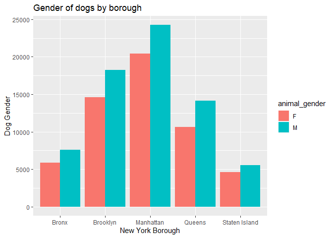
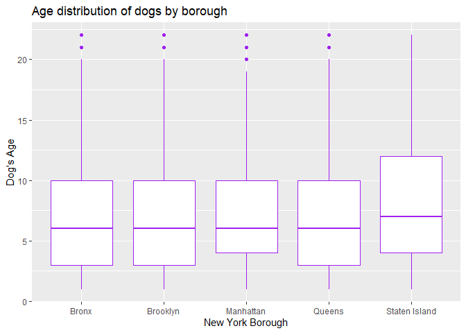
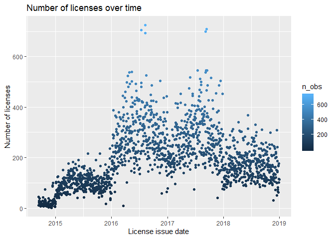
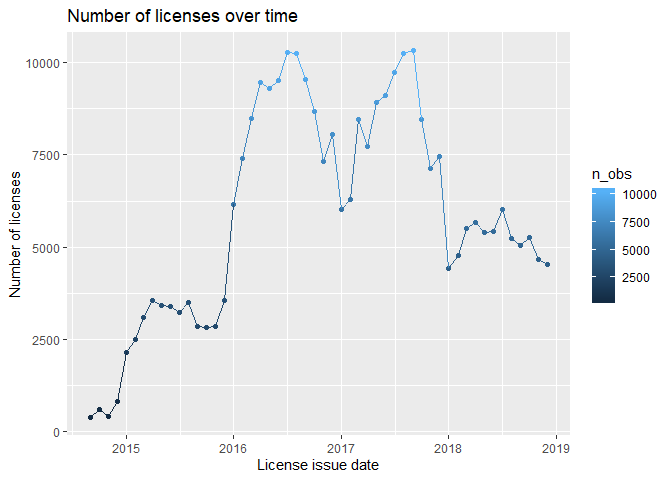
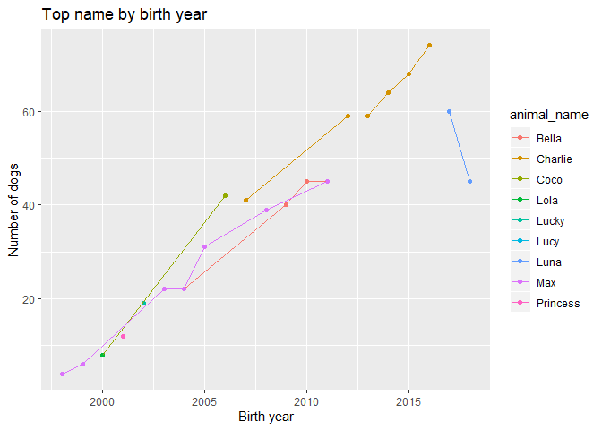
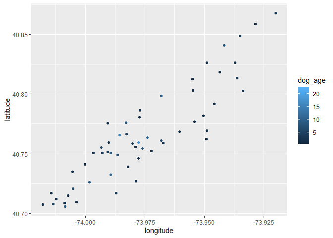

Final project
================
Data Sci Doggos
11/17/2019

``` r
library(tidyverse)
```

    ## ── Attaching packages ───────────────────────────────────────────────────────────────────── tidyverse 1.2.1 ──

    ## ✔ ggplot2 3.2.1     ✔ purrr   0.3.2
    ## ✔ tibble  2.1.3     ✔ dplyr   0.8.3
    ## ✔ tidyr   1.0.0     ✔ stringr 1.4.0
    ## ✔ readr   1.3.1     ✔ forcats 0.4.0

    ## ── Conflicts ──────────────────────────────────────────────────────────────────────── tidyverse_conflicts() ──
    ## ✖ dplyr::filter() masks stats::filter()
    ## ✖ dplyr::lag()    masks stats::lag()

``` r
library(lubridate)
```

    ## 
    ## Attaching package: 'lubridate'

    ## The following object is masked from 'package:base':
    ## 
    ##     date

``` r
library(viridis)
```

    ## Loading required package: viridisLite

``` r
library(leaflet)
lat_lon = read.csv("./data/lat-long.csv")
```

``` r
dogz = read.csv("./data/NYC_Dog_Licensing_Dataset.csv") %>% 
  janitor::clean_names() %>% 
  filter(breed_name != "Unknown",
         extract_year-animal_birth_month < 20) %>% 
  mutate(animal_name = str_to_sentence(animal_name),
         borough = ifelse(zip_code %in% c(10001:10282),"Manhattan", borough),
         borough = ifelse(zip_code %in% c(10301:10314), "Staten Island", borough),
         borough = ifelse(zip_code %in% c(10451:10475), "Bronx", borough),
         borough = ifelse(zip_code %in% c(11004,11101:11106,11109,11351,11354:11375,11377:11379,11385,11411:11423,11426:11430,11432:11436,11691:11694,11697), "Queens", borough),
         borough = ifelse(zip_code %in% c(11201,11203:11226,11228:11239,11241:11243,11249,11252,11256), "Brooklyn", borough),
         borough = as.factor(borough),
         breed_name = as.character(breed_name),
         license_issued_date = as.Date(license_issued_date, format = "%m/%d/%Y"),
         license_expired_date = as.Date(license_expired_date, format = "%m/%d/%Y"),
         license_length = year(license_expired_date) - year(license_issued_date),
         dog_age = 2019 - animal_birth_month,
         breed_name = ifelse(breed_name == "American Pit Bull Terrier/Pit Bull", "American Pit Bull Mix / Pit Bull Mix", breed_name),
         breed_name = ifelse(breed_name == "American Pit Bull Terrier/Pit Bull", "American Pit Bull Mix / Pit Bull Mix", breed_name),
         breed_name = ifelse(breed_name == "Australian Cattle Dog", "Australian Cattledog", breed_name),
         breed_name = ifelse(breed_name == "Bassett Hound", "Basset Hound", breed_name),
         breed_name = ifelse(breed_name == "Brittany", "Brittany Spaniel", breed_name),
         breed_name = ifelse(breed_name == "Coonhound, Black and Tan", "Black and Tan Coonhound", breed_name),
         breed_name = ifelse(breed_name == "Coonhound, Black and Tan", "Black and Tan Coonhound", breed_name),
         breed_name = ifelse(breed_name == "Coonhound, Blue Tick", "Bluetick Coonhound", breed_name),
         breed_name = ifelse(breed_name == "Coonhound, Treeing Walker", "Treeing Walker Coonhound", breed_name),
         breed_name = ifelse(breed_name == "Cotton de Tulear", "Coton de Tulear", breed_name),
         breed_name = ifelse(breed_name == "Japanese Chin/Spaniel", "Japanese Chin", breed_name),
         breed_name = ifelse(breed_name == "Jindo Dog, Korea", "Jindo", breed_name),
         breed_name = ifelse(breed_name == "Mastiff, French (Dogue de Bordeaux)", "Dogue de Bordeaux", breed_name),
         breed_name = ifelse(breed_name == "Pharoh hound", "Pharaoh Hound", breed_name),
         breed_name = ifelse(breed_name == "Schipperke", "Schipperkee", breed_name),
         breed_name = ifelse(breed_name == "Schnauzer, Miniature", "Miniature Schnauzer", breed_name),
         breed_name = ifelse(breed_name == "Schnauzer, Miniature Crossbreed", "Miniature Schnauzer, Crossbreed", breed_name),
         breed_name = ifelse(breed_name == "Welsh Corgi, Cardigan", "Cardigan Welsh Corgi", breed_name),
         breed_name = ifelse(breed_name == "Welsh Corgi, Pembroke", "Pembroke Welsh Corgi", breed_name),
         breed_name = ifelse(breed_name == "Bull Dog, French", "French Bulldog", breed_name),
         breed_name = ifelse(breed_name == "Collie, Bearded", "Bearded Collie", breed_name),
         breed_name = ifelse(breed_name == "Bullmastiff", "Mastiff, Bull", breed_name),
         breed_name = ifelse(breed_name == "Neapolitan Mastiff", "Mastiff, Neapolitan", breed_name),
         breed_name = ifelse(breed_name == "Tibetan Mastiff", "Mastiff, Tibetan", breed_name),
         breed_name = ifelse(breed_name == "Pointer, German Shorthaired", "German Shorthaired Pointer", breed_name),
         breed_name = ifelse(breed_name == "Pointer, German Wirehaired", "German Wirehaired Pointer", breed_name),
         breed_name = ifelse(breed_name == "Schnauzer, Giant", "Giant Schnauzer", breed_name),
         breed_name = ifelse(breed_name == "Schnauzer, Standard", "Standard Schnauzer", breed_name),
         breed_name = ifelse(breed_name == "Chinese Shar-Pei", "Shar-Pei, Chinese", breed_name)) %>% 
  drop_na(borough) %>% 
  rename(animal_birth_year = animal_birth_month, license_id = row_number) %>% 
  select(-extract_year)
```

``` r
dogz_1 =
  dogz %>% 
  distinct(animal_name, animal_gender, animal_birth_year, breed_name, .keep_all = TRUE) %>% 
  select (-license_issued_date, -license_expired_date, -license_length)

distinct_dogz =
  left_join(dogz_1, lat_lon, by = "zip_code") %>% 
  select(-City,-State,-Timezone,-Daylight.savings.time.flag,-geopoint) %>% 
  janitor::clean_names()
```

Plot \#2 Gender of dogs by borough NOTE: having issues with editing the
legend

``` r
plot_2=
  ggplot(distinct_dogz, aes(x = borough, fill = animal_gender)) +
  geom_histogram(position = "dodge", stat = "count") +
  labs(
    title = "Gender of dogs by borough",
    x = "New York Borough",
    y = "Dog Gender"
  )
```

    ## Warning: Ignoring unknown parameters: binwidth, bins, pad

``` r
plot_2
```

<!-- -->

Plot \#3: Age distribution of dogs by boroughs

``` r
plot_3=
  ggplot(distinct_dogz, aes(x = borough, y = dog_age)) +
  geom_boxplot (color = "purple") +
  labs(
    title = "Age distribution of dogs by borough",
    x = "New York Borough",
    y = "Dog's Age"
  )
plot_3
```

<!-- -->

Plot \#4: Breed of dogs by borough

``` r
plot_4=
  distinct_dogz %>% 
  group_by(borough) %>% 
  count(breed_name) %>% 
  top_n(5) %>% 
  ggplot(aes(x = breed_name, y = n)) +
  geom_point() +
  theme(axis.text.x = element_text(angle = 90, hjust = 1)) +
  facet_grid(~borough) +
  labs(
    title = "Top 10 breeds of dogs by borough",
    x = "Dog Breed",
    y = "Total Count"
  )
```

    ## Selecting by n

``` r
plot_4
```

<!-- -->

Plot \#5 License issue date (are there peak times of the year when
people license date) I made three plot options - I think the last two
are the most useful

Scatter plot with all dates

``` r
plot_5 =
dogz %>% 
group_by(license_issued_date) %>% 
  summarize(n_obs = n()) %>% 
    ggplot(aes(x = license_issued_date, y = n_obs, color = n_obs)) + 
    geom_point() +
    labs(title = "Number of licenses over time", 
    x = "License issue date", 
    y = "Number of licenses")
plot_5
```

<!-- -->

Line - condensed to months/years, this one might be more clear\!

``` r
plot_5.5=
  dogz %>% 
  mutate(license_issued_date = floor_date(as_date(license_issued_date), "month")) %>% 
  group_by(license_issued_date) %>% 
  summarize(n_obs = n()) %>% 
      ggplot(aes(x = license_issued_date, y = n_obs, color = n_obs)) + 
      geom_point() + geom_line() +
      labs(title = "Number of licenses over time", 
      x = "License issue date", 
      y = "Number of licenses")
plot_5.5
```

<!-- -->

# monthly trends, might be the most useful realistically

``` r
plot_5.51=
  dogz %>% 
  mutate(license_issued_date = month(license_issued_date),
         license_issued_date = month.abb[license_issued_date],
         license_issued_date = factor(license_issued_date, c("Jan","Feb", "Mar", "Apr", "May", "Jun", "Jul","Aug", "Sep", "Oct","Nov", "Dec"), ordered = TRUE)) %>%
  group_by(license_issued_date) %>% 
  summarize(n_obs = n()) %>% 
      ggplot(aes(x = license_issued_date, y = n_obs)) + 
      geom_point() + geom_line(group=1) +
      labs(title = "Number of licenses issued per month", 
      x = "License issue date", 
      y = "Number of licenses")
plot_5.51
```

<!-- -->

Plot \#6 Most popular dog name by birth year

Top 10 dog names, all time

``` r
top_dogz =
distinct_dogz %>% 
  filter(animal_name != "Unknown",
         animal_name != "Name not provided") %>% 
  group_by(animal_name) %>% 
  summarize(n_obs = n()) %>% 
  arrange(desc(n_obs)) %>% 
  top_n(10)
```

    ## Selecting by n_obs

``` r
knitr::kable(top_dogz)
```

| animal\_name | n\_obs |
| :----------- | -----: |
| Max          |    720 |
| Charlie      |    696 |
| Bella        |    667 |
| Coco         |    633 |
| Lucy         |    568 |
| Lola         |    539 |
| Rocky        |    535 |
| Bailey       |    529 |
| Buddy        |    503 |
| Lucky        |    497 |

Top name by birth year

``` r
plot_6 = 
distinct_dogz %>% 
  filter(animal_name != "Unknown",
         animal_name != "Name not provided",
         animal_name != "Name",
         animal_birth_year != 1997) %>% 
  group_by(animal_birth_year, animal_name) %>% 
  summarize(n_obs = n()) %>% 
  top_n(1) %>% 
    ggplot(aes(x=animal_birth_year, y=n_obs, group = animal_name, color = animal_name)) + geom_point() + geom_line() +
  labs(title = "Top name by birth year", 
    x = "Birth year", 
    y = "Number of dogs")
```

    ## Selecting by n_obs

``` r
plot_6
```

<!-- -->

Plot \#7 Average age of dog

This setion might be problematic - we’d be making a big assumption that
all dogs are still alive\! we could make a new variable for age at first
license, or age at data extraction

``` r
#average dog age.
distinct_dogz %>% 
  summarize(avg_age = mean(dog_age))
```

    ##   avg_age
    ## 1 7.11866

``` r
#average age by breed.
distinct_dogz %>% 
  group_by(breed_name) %>% 
  summarize (avg_age = mean(dog_age)) %>% 
  arrange(desc(avg_age))
```

    ## # A tibble: 293 x 2
    ##    breed_name              avg_age
    ##    <chr>                     <dbl>
    ##  1 Belgian Tervuren           11.9
    ##  2 Miniature Fox Terrier      11  
    ##  3 Peruvian Inca Orchid       11  
    ##  4 Russian Wolfhound          11  
    ##  5 Puli                       10.8
    ##  6 Gordon Setter              10.7
    ##  7 West High White Terrier    10.7
    ##  8 Dachshund Smooth Coat      10.7
    ##  9 Sussex Spaniel             10.5
    ## 10 Poodle, Standard           10.5
    ## # … with 283 more rows

``` r
#10 oldest breeds.
distinct_dogz %>% 
  group_by(breed_name) %>% 
  summarize (avg_age = mean(dog_age)) %>% 
  arrange(desc(avg_age)) %>% 
  top_n(10)
```

    ## Selecting by avg_age

    ## # A tibble: 10 x 2
    ##    breed_name              avg_age
    ##    <chr>                     <dbl>
    ##  1 Belgian Tervuren           11.9
    ##  2 Miniature Fox Terrier      11  
    ##  3 Peruvian Inca Orchid       11  
    ##  4 Russian Wolfhound          11  
    ##  5 Puli                       10.8
    ##  6 Gordon Setter              10.7
    ##  7 West High White Terrier    10.7
    ##  8 Dachshund Smooth Coat      10.7
    ##  9 Sussex Spaniel             10.5
    ## 10 Poodle, Standard           10.5

Plot \#8 Avg age of dog by zip - trying to map by lat/long of zip codes
but it doesnt look like much

``` r
#average age by zip code.
distinct_dogz %>% 
  group_by(zip_code) %>% 
  summarize (avg_age = mean(dog_age))
```

    ## # A tibble: 211 x 2
    ##    zip_code avg_age
    ##       <int>   <dbl>
    ##  1    10001    6.64
    ##  2    10002    6.93
    ##  3    10003    7.15
    ##  4    10004    6.54
    ##  5    10005    6.29
    ##  6    10006    6.44
    ##  7    10007    6.69
    ##  8    10008   11   
    ##  9    10009    7.08
    ## 10    10010    7.13
    ## # … with 201 more rows

``` r
distinct_dogz %>% 
  select(zip_code, borough, dog_age, latitude, longitude) %>% 
  filter(borough == "Manhattan") %>% 
  ggplot(aes(x = longitude, y = latitude, color = dog_age)) +
  geom_point()
```

    ## Warning: Removed 2065 rows containing missing values (geom_point).

<!-- -->

# Regression

``` r
#create reference groups that are coded as 
distinct_dogz_reg = 
  distinct_dogz_reg %>% 
  mutate(
    borough = fct_infreq(borough),
    animal_gender = fct_infreq(animal_gender),
    breed_name = fct_infreq(breed_name)
    )
#run linear regression with dog age as Y and borough, breed name and animal gender as categorical
fit = lm(dog_age ~ borough + animal_gender, data = distinct_dogz)

#view outputs
fit %>% 
  broom::tidy()
```

    ## # A tibble: 7 x 5
    ##   term                 estimate std.error statistic   p.value
    ##   <chr>                   <dbl>     <dbl>     <dbl>     <dbl>
    ## 1 (Intercept)           16.5       2.00        8.27 1.30e- 16
    ## 2 boroughBrooklyn        0.0510    0.0457      1.11 2.65e-  1
    ## 3 boroughManhattan       0.520     0.0439     11.8  2.82e- 32
    ## 4 boroughQueens          0.473     0.0479      9.88 5.42e- 23
    ## 5 boroughStaten Island   1.25      0.0588     21.2  9.03e-100
    ## 6 animal_genderF        -9.72      2.00       -4.86 1.16e-  6
    ## 7 animal_genderM        -9.89      2.00       -4.95 7.47e-  7

``` r
#create tidy table
fit %>% 
  broom::tidy() %>% 
  select(term, estimate, p.value) %>% 
  knitr::kable(digits = 3)
```

| term                 | estimate | p.value |
| :------------------- | -------: | ------: |
| (Intercept)          |   16.541 |   0.000 |
| boroughBrooklyn      |    0.051 |   0.265 |
| boroughManhattan     |    0.520 |   0.000 |
| boroughQueens        |    0.473 |   0.000 |
| boroughStaten Island |    1.247 |   0.000 |
| animal\_genderF      |  \-9.717 |   0.000 |
| animal\_genderM      |  \-9.892 |   0.000 |

``` r
#graph residuals for each borough
distinct_dogz_reg %>% 
  modelr::add_residuals(fit) %>% 
  ggplot(aes(x = borough, y = resid)) + geom_violin()
```

<!-- -->

``` r
#pal <- colorNumeric(
#  palette = "viridis",
#  domain = distinct_dogz$dog_age)
#
#distinct_dogz %>% 
#  filter(borough %in% c("Manhattan", "Brooklyn", "Queens")) %>% 
#  na.omit(dog_age) %>% 
#  sample_n(5000) %>% 
#  mutate(click_label = str_c("<b>$", dog_age, "</b><br>", animal_birth_year, " year<br>", animal_gender, " gender")) %>% 
#  leaflet() %>% 
 # addProviderTiles(providers$CartoDB.Positron) %>% 
 # addCircleMarkers(~longitude, ~latitude, radius = .1, color = ~pal(dog_age), popup = ~click_label)
```
