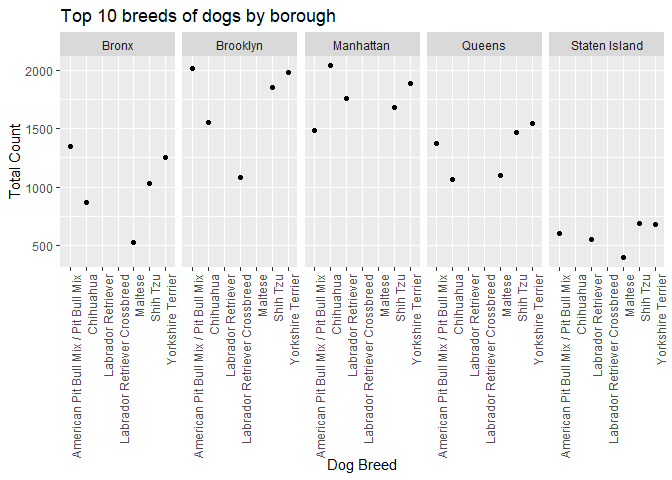

Final project
================
Data Sci Doggos
11/17/2019

``` r
library(tidyverse)
```

    ## ── Attaching packages ─────────────────────────────────────────────────────── tidyverse 1.2.1 ──

    ## ✔ ggplot2 3.2.0     ✔ purrr   0.3.2
    ## ✔ tibble  2.1.1     ✔ dplyr   0.8.3
    ## ✔ tidyr   1.0.0     ✔ stringr 1.4.0
    ## ✔ readr   1.3.1     ✔ forcats 0.4.0

    ## ── Conflicts ────────────────────────────────────────────────────────── tidyverse_conflicts() ──
    ## ✖ dplyr::filter() masks stats::filter()
    ## ✖ dplyr::lag()    masks stats::lag()

``` r
library(lubridate)
```

    ## 
    ## Attaching package: 'lubridate'

    ## The following object is masked from 'package:base':
    ## 
    ##     date

``` r
dogz = read.csv("./data/NYC_Dog_Licensing_Dataset.csv") %>% 
  janitor::clean_names() %>% 
  filter(breed_name != "Unknown",
         extract_year-animal_birth_month < 20) %>% 
  mutate(animal_name = str_to_sentence(animal_name),
         borough = ifelse(zip_code %in% c(10001:10282),"Manhattan", borough),
         borough = ifelse(zip_code %in% c(10301:10314), "Staten Island", borough),
         borough = ifelse(zip_code %in% c(10451:10475), "Bronx", borough),
         borough = ifelse(zip_code %in% c(11004,11101:11106,11109,11351,11354:11375,11377:11379,11385,11411:11423,11426:11430,11432:11436,11691:11694,11697), "Queens", borough),
         borough = ifelse(zip_code %in% c(11201,11203:11226,11228:11239,11241:11243,11249,11252,11256), "Brooklyn", borough),
         borough = as.factor(borough),
         breed_name = as.character(breed_name),
         license_issued_date = as.Date(license_issued_date, format = "%m/%d/%Y"),
         license_expired_date = as.Date(license_expired_date, format = "%m/%d/%Y"),
         license_length = year(license_expired_date) - year(license_issued_date),
         dog_age = 2019 - animal_birth_month,
         breed_name = ifelse(breed_name == "American Pit Bull Terrier/Pit Bull", "American Pit Bull Mix / Pit Bull Mix", breed_name),
         breed_name = ifelse(breed_name == "American Pit Bull Terrier/Pit Bull", "American Pit Bull Mix / Pit Bull Mix", breed_name),
         breed_name = ifelse(breed_name == "Australian Cattle Dog", "Australian Cattledog", breed_name),
         breed_name = ifelse(breed_name == "Bassett Hound", "Basset Hound", breed_name),
         breed_name = ifelse(breed_name == "Brittany", "Brittany Spaniel", breed_name),
         breed_name = ifelse(breed_name == "Coonhound, Black and Tan", "Black and Tan Coonhound", breed_name),
         breed_name = ifelse(breed_name == "Coonhound, Black and Tan", "Black and Tan Coonhound", breed_name),
         breed_name = ifelse(breed_name == "Coonhound, Blue Tick", "Bluetick Coonhound", breed_name),
         breed_name = ifelse(breed_name == "Coonhound, Treeing Walker", "Treeing Walker Coonhound", breed_name),
         breed_name = ifelse(breed_name == "Cotton de Tulear", "Coton de Tulear", breed_name),
         breed_name = ifelse(breed_name == "Japanese Chin/Spaniel", "Japanese Chin", breed_name),
         breed_name = ifelse(breed_name == "Jindo Dog, Korea", "Jindo", breed_name),
         breed_name = ifelse(breed_name == "Mastiff, French (Dogue de Bordeaux)", "Dogue de Bordeaux", breed_name),
         breed_name = ifelse(breed_name == "Pharoh hound", "Pharaoh Hound", breed_name),
         breed_name = ifelse(breed_name == "Schipperke", "Schipperkee", breed_name),
         breed_name = ifelse(breed_name == "Schnauzer, Miniature", "Miniature Schnauzer", breed_name),
         breed_name = ifelse(breed_name == "Schnauzer, Miniature Crossbreed", "Miniature Schnauzer, Crossbreed", breed_name),
         breed_name = ifelse(breed_name == "Welsh Corgi, Cardigan", "Cardigan Welsh Corgi", breed_name),
         breed_name = ifelse(breed_name == "Welsh Corgi, Pembroke", "Pembroke Welsh Corgi", breed_name),
         breed_name = ifelse(breed_name == "Bull Dog, French", "French Bulldog", breed_name),
         breed_name = ifelse(breed_name == "Collie, Bearded", "Bearded Collie", breed_name),
         breed_name = ifelse(breed_name == "Bullmastiff", "Mastiff, Bull", breed_name),
         breed_name = ifelse(breed_name == "Neapolitan Mastiff", "Mastiff, Neapolitan", breed_name),
         breed_name = ifelse(breed_name == "Tibetan Mastiff", "Mastiff, Tibetan", breed_name),
         breed_name = ifelse(breed_name == "Pointer, German Shorthaired", "German Shorthaired Pointer", breed_name),
         breed_name = ifelse(breed_name == "Pointer, German Wirehaired", "German Wirehaired Pointer", breed_name),
         breed_name = ifelse(breed_name == "Schnauzer, Giant", "Giant Schnauzer", breed_name),
         breed_name = ifelse(breed_name == "Schnauzer, Standard", "Standard Schnauzer", breed_name),
         breed_name = ifelse(breed_name == "Chinese Shar-Pei", "Shar-Pei, Chinese", breed_name)) %>% 
  drop_na(borough) %>% 
  rename(animal_birth_year = animal_birth_month, license_id = row_number) %>% 
  select(-extract_year)

head(dogz)
```

    ##   license_id animal_name animal_gender animal_birth_year
    ## 1          1       Paige             F              2014
    ## 2          2        Yogi             M              2010
    ## 3          3         Ali             M              2014
    ## 4          4       Queen             F              2013
    ## 5          5        Lola             F              2009
    ## 6          8   Chewbacca             F              2012
    ##                             breed_name   borough zip_code
    ## 1 American Pit Bull Mix / Pit Bull Mix Manhattan    10035
    ## 2                                Boxer     Bronx    10465
    ## 3                              Basenji Manhattan    10013
    ## 4                     Akita Crossbreed Manhattan    10013
    ## 5                              Maltese Manhattan    10028
    ## 6        Labrador Retriever Crossbreed Manhattan    10013
    ##   license_issued_date license_expired_date license_length dog_age
    ## 1          2014-09-12           2017-09-12              3       5
    ## 2          2014-09-12           2017-10-02              3       9
    ## 3          2014-09-12           2019-09-12              5       5
    ## 4          2014-09-12           2017-09-12              3       6
    ## 5          2014-09-12           2017-10-09              3      10
    ## 6          2014-09-12           2019-10-01              5       7

``` r
distinct_dogz =
  dogz %>% 
  distinct(animal_name, animal_gender, animal_birth_year, breed_name, .keep_all = TRUE) %>% 
  select (-license_issued_date, -license_expired_date, -license_length)
```

Plot \#1: Dogs in New York City

Plot \#2 Gender of dogs by borough

``` r
plot_2=
  ggplot(distinct_dogz, aes(x = borough, y = animal_gender)) +
  geom_col(position = "stack") +
  labs(
    title = "Gender of dogs by borough",
    x = "New York Borough",
    y = "Dog Gender"
  )
plot_2
```

<!-- -->

Plot \#3: Age distribution of dogs by boroughs

``` r
plot_3=
  ggplot(distinct_dogz, aes(x = borough, y = dog_age)) +
  geom_violin (color = "pink") +
  labs(
    title = "Age distribution of dogs by borough",
    x = "New York Borough",
    y = "Dog's Age"
  )
plot_3
```

<!-- -->

Plot \#4: Breed of dogs by borough

``` r
plot_4 = 
  distinct_dogz %>% 
  top_n(10) %>% 
  ggplot(aes(x = borough, y = breed_name)) +
  geom_point() +
  labs(
    title = "Top 10 breeds of dogs by borough",
    x = "New York Borough",
    y = "Dog Breed"
  )
```

    ## Selecting by dog_age

``` r
plot_4
```

<!-- -->
