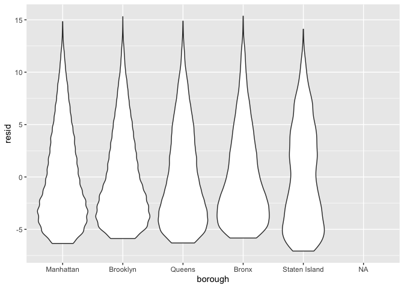

final\_regression
================
Mary Knoop
11/22/2019

``` r
#create reference groups that are coded as 
distinct_dogz_reg = 
  distinct_dogz_reg %>% 
  mutate(
    borough = fct_infreq(borough),
    animal_gender = fct_infreq(animal_gender),
    breed_name = fct_infreq(breed_name)
    )
#run linear regression with dog age as Y and borough, breed name and animal gender as categorical
fit = lm(dog_age ~ borough + animal_gender, data = distinct_dogz)

#view outputs
fit %>% 
  broom::tidy()
```

    ## # A tibble: 7 x 5
    ##   term                 estimate std.error statistic  p.value
    ##   <chr>                   <dbl>     <dbl>     <dbl>    <dbl>
    ## 1 (Intercept)           16.5       2.00        8.27 1.31e-16
    ## 2 boroughBrooklyn        0.0504    0.0457      1.10 2.70e- 1
    ## 3 boroughManhattan       0.520     0.0439     11.8  2.86e-32
    ## 4 boroughQueens          0.474     0.0479      9.90 4.11e-23
    ## 5 boroughStaten Island   1.25      0.0588     21.2  1.15e-99
    ## 6 animal_genderF        -9.72      2.00       -4.86 1.17e- 6
    ## 7 animal_genderM        -9.89      2.00       -4.95 7.49e- 7

``` r
#create tidy table
fit %>% 
  broom::tidy() %>% 
  select(term, estimate, p.value) %>% 
  knitr::kable(digits = 3)
```

| term                 | estimate | p.value |
| :------------------- | -------: | ------: |
| (Intercept)          |   16.541 |    0.00 |
| boroughBrooklyn      |    0.050 |    0.27 |
| boroughManhattan     |    0.520 |    0.00 |
| boroughQueens        |    0.474 |    0.00 |
| boroughStaten Island |    1.247 |    0.00 |
| animal\_genderF      |  \-9.715 |    0.00 |
| animal\_genderM      |  \-9.891 |    0.00 |

``` r
#graph residuals for each borough
distinct_dogz_reg %>% 
  modelr::add_residuals(fit) %>% 
  ggplot(aes(x = borough, y = resid)) + geom_violin()
```

    ## Warning: Removed 503 rows containing non-finite values (stat_ydensity).

<!-- -->
